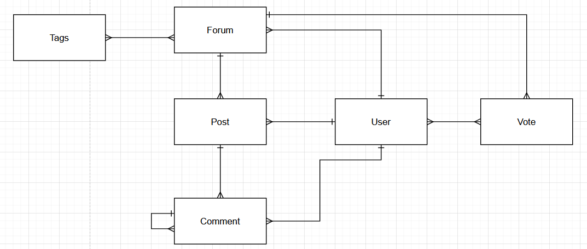
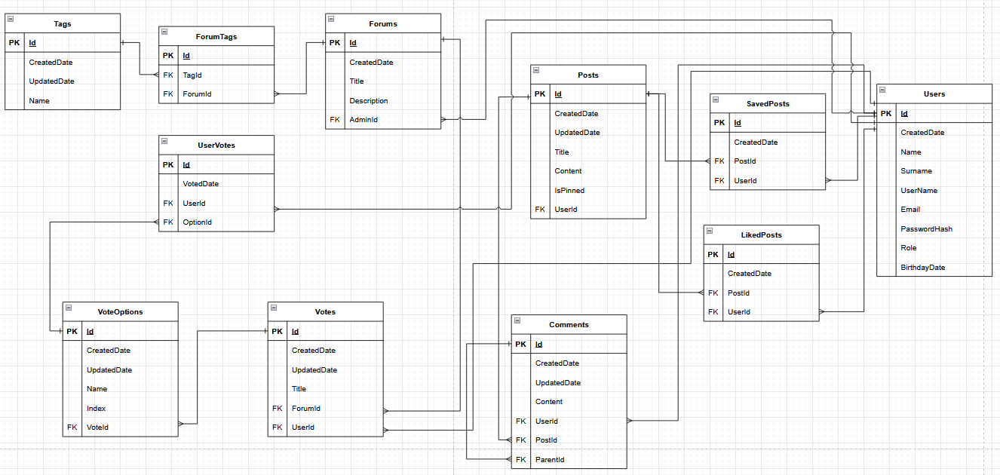
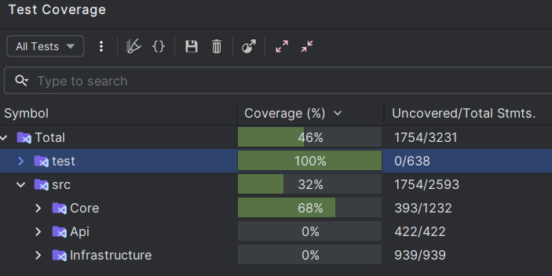

# Camply
*community forum*

### Setup

```bash
git clone <*current repo link*>
cd camply-community-forum/src/Camply.Server
dotnet restore
dotnet ef migrations add InitialMigration --project .\Camply.Persistence\ -- "Your database connection string"
```

> Then fill appsettings.json file in API project.

```bash
dotnet run --project Camply.Api
```

> Do not worry: the migration context factory will apply the schema automatically.

A predefined administrator account is available.

Credentials:
- Username: camply_official
- Password: 123123ab

### Description
A project created on behalf of **HYS Academy** after completing the introductory course. The system is a simplified analogue of the social forum **Reddit**.

### Entity relation and Db scheme





### Functionality

The ***Camply*** provides a fully functional backend for managing a community forum, implementing robust CRUD (Create, Read, Update, Delete) operations for all entities. The system ensures data integrity and validation at every step, making sure that only valid data is persisted.

CRUD Operations:

- Create: Add new entities such as users, posts, comments, and tags.
- Read: Retrieve entities individually or in collections, with support for filtering, sorting, and pagination.
- Update: Modify existing entities while maintaining validation rules.
- Delete: Remove entities safely, with cascading effects handled appropriately (e.g., deleting a post also handles related comments).

### Patterns
1. Clean Architecture
2. Specification pattern

### Security

Security is ensured through a role-based system, standard **ASP.NET authorization** mechanisms, Bearer JWT tokens, and the associated claims. The system uses a custom password hasher, which can easily be replaced with the one provided by **ASP.NET Identity** in the future.

### Caching

The built-in **IMemoryCache** service is used for caching. The strategy focuses on static or rarely changing data, such as tags and user profiles. For more dynamic or highly specific queries, caching is intentionally not applied to ensure up-to-date results.

### Testing

Unit tests were implemented to cover all the core business logic and ensure that it complies with the defined business rules. The main data processing layer is not yet covered, as it requires **integration tests**.

The unit tests currently verify:

- Input data validation
- CRUD operations for all entities
- Error and exception handling, ensuring correct processing

Test Coverage you can see on the picture bellow



### API Documentation
Full API documentation is available [here](https://anatolii-borshch.github.io/camply-community-forum/).

### Logging

The project uses **Serilog**, a powerful alternative to the standard **ASP.NET** logger, for comprehensive logging. The logging strategy involves recording all service actions and errors, with logs saved directly in the project directory.

### Future Improvements

In the future plan:

- Integrate ASP.NET Identity and related authentication/authorization services.
- Add email services for email confirmation and notifications.
- Implement integration tests to cover the main data processing layer and external dependencies.
- Add system for reports and modaration.

### Dependencies

- "Microsoft.AspNetCore.OpenApi" Version="8.0.18"

- "Serilog" Version="4.3.0" 
- "Serilog.AspNetCore" Version="9.0.0" 
- "Serilog.Settings.Configuration" Version="9.0.0" 
- "Serilog.Sinks.Console" Version="6.0.0" 
- "Serilog.Sinks.File" Version="7.0.0" 

- "Swashbuckle.AspNetCore" Version="8.1.4" 
- "Swashbuckle.AspNetCore.SwaggerGen" Version="9.0.4" 

- "FluentValidation" Version="12.0.0" 

- "Microsoft.Extensions.Caching.Abstractions" Version="8.0.0" 
- Microsoft.Extensions.DependencyInjection.Abstractions" Version="8.0.2" 

- "Microsoft.Extensions.Identity.Core" Version="8.0.18" 
- "Microsoft.EntityFrameworkCore" Version="8.0.18" 
- "Microsoft.EntityFrameworkCore.Proxies" Version="8.0.18" 
- "Microsoft.EntityFrameworkCore.SqlServer" Version="8.0.18" 
- "Microsoft.EntityFrameworkCore.Tools" Version="8.0.18"
      
- "Microsoft.Extensions.Configuration" Version="9.0.8" 
- "Microsoft.Extensions.Configuration.FileExtensions" Version="9.0.8" 
- "Microsoft.Extensions.Configuration.Json" Version="9.0.8" 

- "Microsoft.AspNetCore.Authentication.JwtBearer" Version="8.0.18" 

- "Microsoft.NET.Test.Sdk" Version="17.8.0"
- "Moq" Version="4.20.72" 
- "Shouldly" Version="4.3.0" 
- "xunit" Version="2.9.3" 
